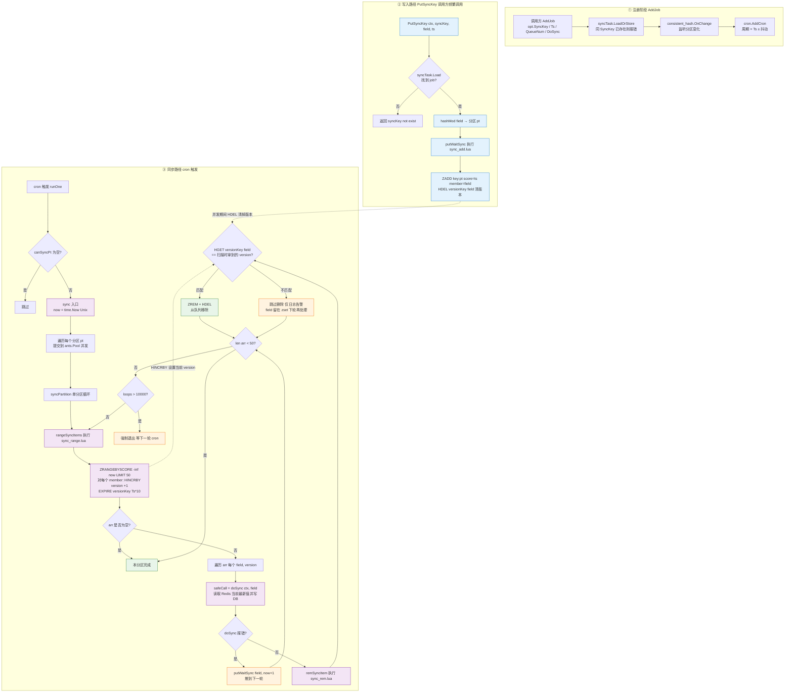

```mermaid
flowchart TD
      %% ========== 注册阶段 ==========
      subgraph REG["① 注册阶段 AddJob"]
          A1[调用方 AddJob<br/>opt.SyncKey / Ts / QueueNum / DoSync] --> A2[syncTask.LoadOrStore<br/>同 SyncKey 已存在则报错]
          A2 --> A3[consistent_hash.OnChange<br/>监听分区变化]
          A3 --> A4[cron.AddCron<br/>周期 = Ts ± 抖动]
      end

      %% ========== 写入路径 ==========
      subgraph PUT["② 写入路径 PutSyncKey 调用方频繁调用"]
          P1[PutSyncKey ctx, syncKey, field, ts] --> P2{syncTask.Load<br/>找到 job?}
          P2 -- 否 --> P3[返回 syncKey not exist]
          P2 -- 是 --> P4[hashMod field → 分区 pt]
          P4 --> P5[putWaitSync 执行 sync_add.lua]
          P5 --> P6["ZADD key:pt score=ts member=field<br/>HDEL versionKey field 清版本"]
      end

      %% ========== 同步路径 ==========
      subgraph SYNC["③ 同步路径 cron 触发"]
          S1[cron 触发 runOne] --> S2{canSyncPt 为空?}
          S2 -- 是 --> S3[跳过]
          S2 -- 否 --> S4["sync 入口<br/>now = time.Now Unix"]
          S4 --> S5[遍历每个分区 pt<br/>提交到 ants.Pool 并发]
          S5 --> S6[syncPartition 单分区循环]
          S6 --> S7[rangeSyncItems 执行 sync_range.lua]
          S7 --> S8["ZRANGEBYSCORE -inf now LIMIT 50<br/>对每个 member: HINCRBY version +1<br/>EXPIRE versionKey Ts*10"]
          S8 --> S9{arr 是否为空?}
          S9 -- 是 --> S_END[本分区完成]
          S9 -- 否 --> S10[遍历 arr 每个 field, version]
          S10 --> S11[safeCall = doSync ctx, field<br/>读取 Redis 当前最新值并写 DB]
          S11 --> S12{doSync 报错?}
          S12 -- 是 --> S13["putWaitSync field, now+1<br/>推到下一轮"]
          S12 -- 否 --> S14[remSyncItem 执行 sync_rem.lua]
          S14 --> S15{"HGET versionKey field<br/>== 扫描时拿到的 version?"}
          S15 -- 匹配 --> S16[ZREM + HDEL<br/>从队列移除]
          S15 -- 不匹配 --> S17[跳过删除 仅日志告警<br/>field 留在 zset 下轮再处理]
          S13 --> S18{len arr < 50?}
          S16 --> S18
          S17 --> S18
          S18 -- 是 --> S_END
          S18 -- 否 --> S19{loops > 10000?}
          S19 -- 是 --> S_OVF[强制退出 等下一轮 cron]
          S19 -- 否 --> S7
      end

      %% ========== 并发竞争点 ==========
      P6 -. "并发期间 HDEL 清掉版本" .-> S15
      S8 -. "HINCRBY 设置当前 version" .-> S15

      %% ========== 样式 ==========
      classDef put fill:#e3f2fd,stroke:#1976d2
      classDef sync fill:#f3e5f5,stroke:#7b1fa2
      classDef warn fill:#fff3e0,stroke:#ef6c00
      classDef ok fill:#e8f5e9,stroke:#2e7d32
      class P1,P4,P5,P6 put
      class S4,S7,S8,S11,S14 sync
      class S13,S17,S_OVF warn
      class S16,S_END ok
```